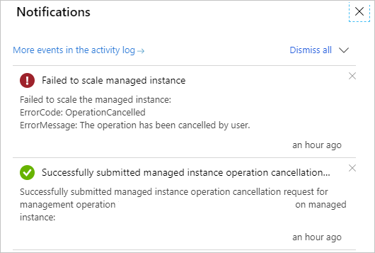

# Canceling Azure SQL Managed Instance management operations
[!INCLUDE[appliesto-sqlmi](../includes/appliesto-sqlmi.md)]

Azure SQL Managed Instance provides the ability to cancel some [management operations](management-operations-overview.md), such as when you deploy a new managed instance or update instance properties. 

## Overview

 All management operations can be categorized as follows:

- Instance deployment (new instance creation).
- Instance update (changing instance properties, such as vCores or reserved storage).
- Instance deletion.

You can [monitor progress and status of management operations](management-operations-monitor.md) and cancel some of them if necessary. 

The following table summarizes management operations, whether or not you can cancel them, and their typical overall duration:

Category  |Operation  |Cancelable  |Estimated cancel duration  |
|---------|---------|---------|---------|
|Deployment |Instance creation |Yes |90% of operations finish in 5 minutes. |
|Update |Instance storage scaling up/down (General Purpose) |No |  |
|Update |Instance storage scaling up/down (Business Critical) |Yes |90% of operations finish in 5 minutes. |
|Update |Instance compute (vCores) scaling up and down (General Purpose) |Yes |90% of operations finish in 5 minutes. |
|Update |Instance compute (vCores) scaling up and down (Business Critical) |Yes |90% of operations finish in 5 minutes. |
|Update |Instance service tier change (General Purpose to Business Critical and vice versa) |Yes |90% of operations finish in 5 minutes. |
|Delete |Instance deletion |No |  |

## Cancel management operation

# [Portal](#tab/azure-portal)

To cancel management operations using the Azure portal, follow these steps:

1. Go  to the [Azure portal](https://portal.azure.com)
1. Go to the **Overview** pane of your SQL Managed Instance. 
1. Select the **Notification** box next to the ongoing operation to open the **Ongoing Operation** page. 

   :::image type="content" source="media/management-operations-cancel/open-ongoing-operation.png" alt-text="Select the ongoing operation box to open the ongoing operation page.":::

1. Select **Cancel the operation** at the bottom of the page. 

   :::image type="content" source="media/management-operations-cancel/cancel-operation.png" alt-text="Select cancel to cancel the operation.":::

1. Confirm that you want to cancel the operation. 


If the cancel request succeeds, the management operation is canceled and results in a failure. You will get a notification that the cancellation succeeds or fails.




If the cancel request fails or the cancel button is not active, it means that the management operation has entered non-cancelable state and that will finish shortly.  The management operation will continue its execution until it is completed.

# [PowerShell](#tab/azure-powershell)

If you don't already have Azure PowerShell installed, see [Install the Azure PowerShell module](/powershell/azure/install-az-ps).

To cancel a management operation, you need to specify management operation name. Therefore, first use the get command to retrieve the operation list, and then cancel specific the operation.

```powershell-interactive
$managedInstance = "<Your-instance-name>"
$resourceGroup = "<Your-resource-group-name>"

$managementOperations = Get-AzSqlInstanceOperation -ManagedInstanceName $managedInstance  -ResourceGroupName $resourceGroup

foreach ($mo in $managementOperations ) {
	if($mo.State -eq "InProgress" -and $mo.IsCancellable){
		$cancelRequest = Stop-AzSqlInstanceOperation -ResourceGroupName $resourceGroup -ManagedInstanceName $managedInstance -Name $mo.Name
		Get-AzSqlInstanceOperation -ManagedInstanceName $managedInstance  -ResourceGroupName $resourceGroup -Name $mo.Name
	}
}
```

For detailed commands explanation, see [Get-AzSqlInstanceOperation](/powershell/module/az.sql/get-azsqlinstanceoperation) and [Stop-AzSqlInstanceOperation](/powershell/module/az.sql/stop-azsqlinstanceoperation).

# [Azure CLI](#tab/azure-cli)

If you don't already have the Azure CLI installed, see [Install the Azure CLI](/cli/azure/install-azure-cli).

To cancel the management operation, you need to specify the management operation name. Therefore, first use the get command to retrieve the operation list, and then cancel the specific operation.

```azurecli-interactive
az sql mi op list -g yourResourceGroupName --mi yourInstanceName |
   --query "[?state=='InProgress' && isCancellable].{Name: name}" -o tsv |
while read -r operationName; do

az sql mi op cancel -g yourResourceGroupName --mi yourInstanceName -n $operationName
done
```

For detailed commands explanation, see [az sql mi op](/cli/azure/sql/mi/op).

---

## Canceled deployment request

With API version 2020-02-02, as soon as the instance creation request is accepted, the instance starts to exist as a resource, no matter the progress of the deployment process (managed instance status is **Provisioning**). If you cancel the instance deployment request (new instance creation), the managed instance will go from the **Provisioning** state to **FailedToCreate**.

Instances that have failed to create are still present as a resource and: 

- Are not charged
- Do not count towards resource limits (subnet or vCore quota)


> [!NOTE]
> To minimize noise in the the list of resources or managed instances, delete instances that have failed to deploy or instances with cancelled deployments. 


## Next steps

- To learn how to create your first managed instance, see [Quickstart guide](instance-create-quickstart.md).
- For a features and comparison list, see [Common SQL features](../database/features-comparison.md).
- For more information about VNet configuration, see [SQL Managed Instance VNet configuration](connectivity-architecture-overview.md).
- For a quickstart that creates a managed instance and restores a database from a backup file, see [Create a managed instance](instance-create-quickstart.md).
- For a tutorial about using Azure Database Migration Service for migration, see [SQL Managed Instance migration using Database Migration Service](/azure/dms/tutorial-sql-server-to-managed-instance).
