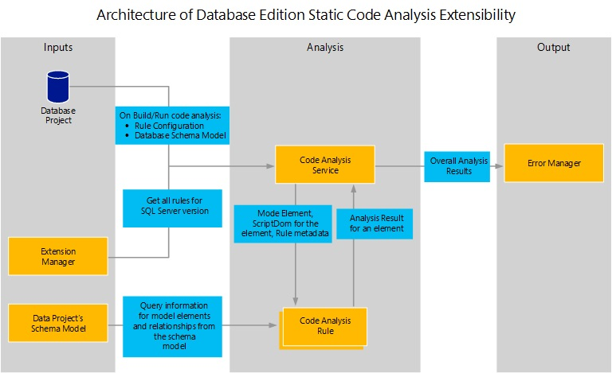

# Overview of Extensibility for Database Code Analysis Rules

Visual Studio editions containing SQL Server Data Tools include code analysis rules to report on Transact-SQL design, naming, and performance warnings in your database code. For more information, see [Analyzing Database Code to Improve Code Quality](/previous-versions/visualstudio/visual-studio-2010/dd172133(v=vs.100)).  
  
If the built-in code analysis rules do not include coverage for a specific Transact-SQL issue that you want included you can create custom database code analysis rules. For example, you might want to create a custom rule that avoids using the WAITFOR DELAY statement, as demonstrated in [Walkthrough Authoring a Custom Static Code Analysis Rule Assembly for SQL Server](../ssdt/walkthrough-author-custom-static-code-analysis-rule-assembly.md). To create custom database code analysis rules, you use the classes in the [CodeAnalysis](/dotnet/api/microsoft.sqlserver.dac.codeanalysis) namespace.  
  
Before you create custom code analysis rules, you should understand the basic architecture among the various components of database code analysis rules.  
  
## Database Code Analysis Rules Components  
The following diagram illustrates how database code analysis rules components interact:  
  
  
  
When you use the database code analysis rules feature, either by running static code analysis directly (for more information, see [How to: Analyze Transact-SQL Code to Find Defects](/previous-versions/visualstudio/visual-studio-2010/dd172119(v=vs.100))) or by performing a build, all the rules are loaded and used according to how you have configured them in your project. For more information, see [How to: Enable and Disable Specific Rules for Static Analysis of Database Code](/previous-versions/visualstudio/visual-studio-2010/dd172131(v=vs.100)). The Extension Manager will also load any custom rule assemblies that you have created and registered. For more information, see [How to: Install and Manage Feature Extensions](../ssdt/how-to-install-and-manage-feature-extensions.md).  
  
A custom code analysis rule class inherits from [SqlCodeAnalysisRule](/dotnet/api/microsoft.sqlserver.dac.codeanalysis.sqlcodeanalysisrule). The custom rule class can access a number of useful objects via its rule execution context. These include:  
  
-   Metadata about the rule itself.  
  
-   The Dac.Model.TSqlModel representing the database's schema, including all the model elements, relationships between these and any properties of the elements.  
  
-   For rules that examine specific elements the Dac.Model.TSqlObject representing that schema element in the model is included in the context.  
  
-   Many schema objects also have a [ScriptDom](/dotnet/api/microsoft.sqlserver.transactsql.scriptdom) representation which can be accessed via this context -This is an AST-based representation of an element that can be useful when trying to see potential syntax issues such as the presence of [SelectStarExpression](/dotnet/api/microsoft.sqlserver.transactsql.scriptdom.selectstarexpression).  
  
A Dac.CodeAnalysis.SqlRuleProblem is created by the rule to represent any problems found by it. When creating this, the relevant Dac.Model.TSqlObject and possibly a [ScriptDom](/dotnet/api/microsoft.sqlserver.transactsql.scriptdom) representation element are passed into the constructor, and these are used to determine the location of the problem in your source code files. At the end of analysis, all of these problems are passed to the Error Manager and displayed in the Error List.  
  
## See Also  
[Extending the Database Features](../ssdt/extending-the-database-features.md)  
