# Tutorial: Configure replication between a server and mobile clients (merge)
 [!INCLUDE [SQL Server](../../includes/applies-to-version/sqlserver.md)]
Merge replication is a good solution to the problem of moving data between a central server and mobile clients that are only occasionally connected. By using the replication wizards, you can easily configure and administer a merge replication topology. 

This tutorial shows you how to configure a replication topology for mobile clients. For more information about merge replication, see the [overview of merge replication](./merge/merge-replication.md).
  
## What you will learn  
This tutorial teaches you to use merge replication to publish data from a central database to one or more mobile users so that each user gets a uniquely filtered subset of the data. 

In this tutorial, you will learn how to:
> [!div class="checklist"]
> * Configure a publisher for merge replication.
> * Add a mobile subscriber for merge publication.
> * Synchronize the subscription to the merge publication.
  
## Prerequisites  
This tutorial is for users who are familiar with fundamental database operations, but who have limited experience with replication. Before you start this tutorial, you must complete [Tutorial: Prepare SQL Server for replication](../../relational-databases/replication/tutorial-preparing-the-server-for-replication.md).  
  
To complete this tutorial, you need SQL Server, SQL Server Management Studio (SSMS), and an AdventureWorks database: 
  
- At the publisher server (source), install:  
  
   - Any edition of SQL Server, except for SQL Server Express or SQL Server Compact. These editions cannot be a replication publisher.   
   - The [!INCLUDE[ssSampleDBobject](../../includes/sssampledbobject-md.md)] sample database. To enhance security, the sample databases are not installed by default.  
  
- At the subscriber server (destination), install any edition of SQL Server, except SQL Server Express or SQL Server Compact. The publication that's created in this tutorial does not support either SQL Server Express or SQL Server Compact. 

- Install [SQL Server Management Studio](../../ssms/download-sql-server-management-studio-ssms.md).
- Install [SQL Server 2017 Developer edition](https://www.microsoft.com/sql-server/sql-server-downloads).
- Download the [AdventureWorks sample database](https://github.com/Microsoft/sql-server-samples/releases). For instructions on restoring a database in SSMS, see [Restoring a database](../backup-restore/restore-a-database-backup-using-ssms.md).  
 
  
>[!NOTE]
> Replication is not supported on SQL Server instances that are more than two versions apart.
>
> In [!INCLUDE[ssManStudioFull](../../includes/ssmanstudiofull-md.md)], you must connect to the publisher and subscriber by using a login that is a member of the **sysadmin** fixed server role. For more information on this role, see [Server-level roles](../security/authentication-access/server-level-roles.md).  
  
  
**Estimated time to complete this tutorial: 60 minutes**  
  
## Configure a publisher for merge replication
In this section, you create a merge publication by using [!INCLUDE[ssManStudioFull](../../includes/ssmanstudiofull-md.md)] to publish a subset of the **Employee**, **SalesOrderHeader**, and **SalesOrderDetail** tables in the [!INCLUDE[ssSampleDBobject](../../includes/sssampledbobject-md.md)] sample database. These tables are filtered with parameterized row filters so that each subscription contains a unique partition of the data. You also add the [!INCLUDE[ssNoVersion](../../includes/ssnoversion-md.md)] login used by the Merge Agent to the publication access list (PAL).  
  
### Create merge publication and define articles  
  
1. Connect to the publisher in [!INCLUDE[ssManStudioFull](../../includes/ssmanstudiofull-md.md)], and then expand the server node.  
  
2. Start the SQL Server Agent by right-clicking it in Object Explorer and selecting **Start**. If this step doesn't start the agent, you'll need to manually do so from SQL Server Configuration Manager.  
3. Expand the **Replication** folder, right-click **Local Publications**, and select **New Publication**. The New Publication Wizard starts:  

   
  
3. On the **Publication Database** page, select [!INCLUDE[ssSampleDBobject](../../includes/sssampledbobject-md.md)], and then select **Next**. 

      
4. On the **Publication Type** page, select **Merge publication**, and then select **Next**.  
   
5. On the **Subscriber Types** page, ensure that only [!INCLUDE[sql2008-md](../../includes/sql2008-md.md)] or later is selected, and then select **Next**: 

    
  
   
6. On the **Articles** page, expand the **Tables** node. Select the following three tables: **Employee**, **SalesOrderHeader**, and **SalesOrderDetail**. Select **Next**.  

   

   >[!NOTE]
   > The **Employee** table contains a column (**OrganizationNode**) that has the **hierarchyid** data type. This data type is supported for replication only in SQL Server 2017. 
   >
   > If you're using a build earlier than SQL Server 2017, a message appears at the bottom of the screen to notify you of potential data loss for using this column in bidirectional replication. For the purpose of this tutorial, you can ignore this message. However, this data type should not be replicated in a production environment unless you're using the supported build.
   > 
   > For more information about replicating the **hierarchyid** data type, see [Using hierarchyid columns in replication](../../t-sql/data-types/hierarchyid-data-type-method-reference.md#using-hierarchyid-columns-in-replicated-tables).
    
  
7. On the **Filter Table Rows** page, select **Add** and then select **Add Filter**.  
  
8. In the **Add Filter** dialog box, select **Employee (HumanResources)** in **Select the table to filter**. Select the **LoginID** column, select the right arrow to add the column to the WHERE clause of the filter query, and modify the WHERE clause as follows:  
  
   ```sql 
    WHERE [LoginID] = HOST_NAME()  
   ```  
  
   Select **A row from this table will go to only one subscription**, and select **OK**.  
 
   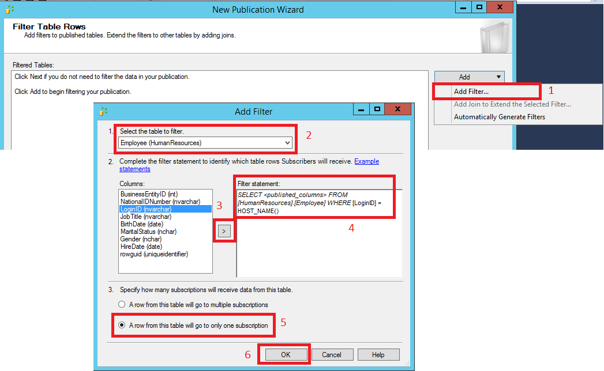

    
  
10. On the **Filter Table Rows** page, select **Employee (Human Resources)**, select **Add**, and then select **Add Join to Extend the Selected Filter**.  
  
    a. In the **Add Join** dialog box, select **Sales.SalesOrderHeader** under **Joined table**. Select **Write the join statement manually**, and complete the join statement as follows:  
  
    ```sql  
    ON [Employee].[BusinessEntityID] =  [SalesOrderHeader].[SalesPersonID] 
    ```  
  
    b. In **Specify join options**, select **Unique key**, and then select **OK**.

    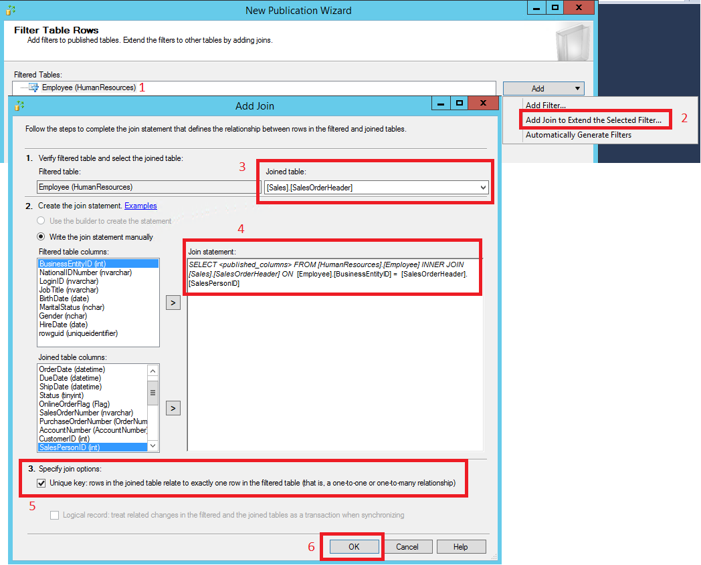

  
13. On the **Filter Table Rows** page, select **SalesOrderHeader**, select **Add**, and then select **Add Join to Extend the Selected Filter**.  
  
    a. In the **Add Join** dialog box, select **Sales.SalesOrderDetail** under **Joined table**.    
    b. Select **Use the Builder to create the statement**.  
    c. In the **Preview** box, confirm that the join statement is as follows:  
  
    ```sql  
    ON [SalesOrderHeader].[SalesOrderID] = [SalesOrderDetail].[SalesOrderID] 
    ```  
  
    d. In **Specify join options**, select **Unique key**, and then select **OK**. Select **Next**. 

    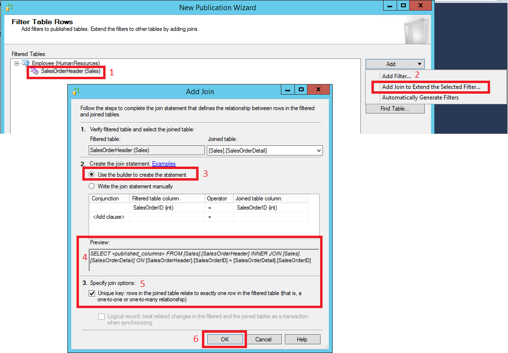
  
21. Select **Create a snapshot immediately**, clear **Schedule the snapshot agent to run at the following times**, and select **Next**:  

    
  
22. On the **Agent Security** page, select **Security Settings**. Enter <*Publisher_Machine_Name*>**\repl_snapshot** in the **Process account** box, supply the password for this account, and then select **OK**. Select **Next**.  

    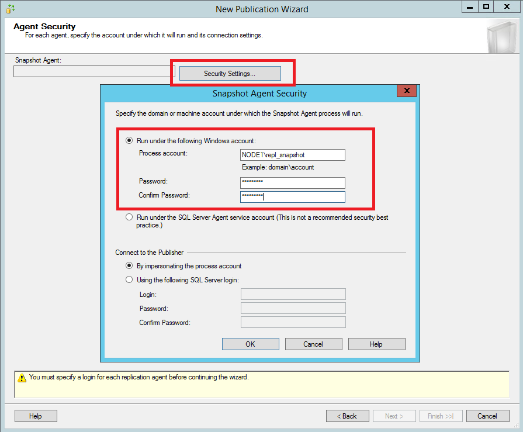
  
23. On the **Complete the Wizard** page, enter **AdvWorksSalesOrdersMerge** in the **Publication name** box and select **Finish**:  

    
  
24. After the publication is created, select **Close**. Under the **Replication** node in **Object Explorer**, right-click **Local Publications** and select **Refresh** to view your new merge replication.  
  
### View the status of snapshot generation  
  
1. Connect to the publisher in [!INCLUDE[ssManStudioFull](../../includes/ssmanstudiofull-md.md)], expand the server node, and then expand the **Replication** folder.  
  
2. In the **Local Publications** folder, right-click **AdvWorksSalesOrdersMerge**, and then select **View Snapshot Agent Status**:  

   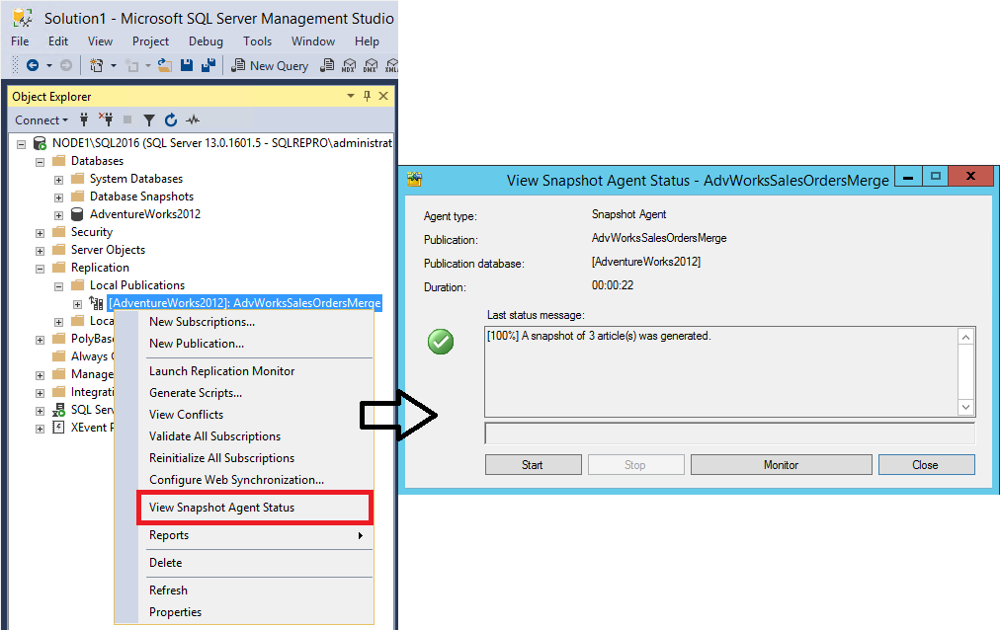
  
3. The current status of the Snapshot Agent job for the publication appears. Ensure that the snapshot job has succeeded before you continue to the next lesson.  
  
### Add the Merge Agent login to the PAL  
  
1. Connect to the publisher in [!INCLUDE[ssManStudioFull](../../includes/ssmanstudiofull-md.md)], expand the server node, and then expand the **Replication** folder.  
  
2. In the **Local Publications** folder, right-click **AdvWorksSalesOrdersMerge**, and then select **Properties**.  
  
   a. Select the **Publication Access List** page, and select **Add**. 
  
   b. In the **Add Publication Access** dialog box, select <*Publisher_Machine_Name*>**\repl_merge** and select **OK**. Select **OK** again. 

   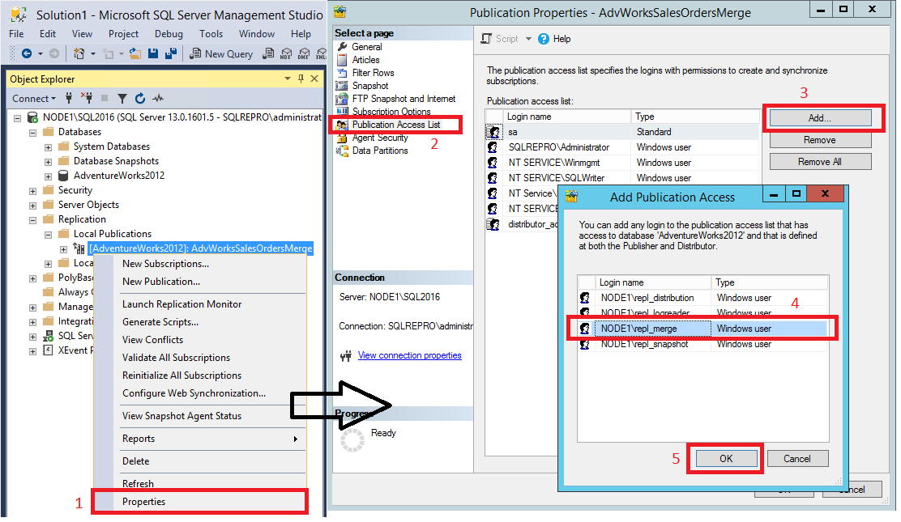 

  
For more information, see:  
- [Filter published data](../../relational-databases/replication/publish/filter-published-data.md) 
- [Parameterized row filters](../../relational-databases/replication/merge/parameterized-filters-parameterized-row-filters.md)  
- [Define an article](../../relational-databases/replication/publish/define-an-article.md)  
  
  
## Create a subscription to the merge publication
In this section, you add a subscription to the merge publication that you created previously. This tutorial uses the remote subscriber (NODE2\SQL2016). You then set permissions on the subscription database and manually generate the filtered data snapshot for the new subscription.   
  
### Add a subscriber for merge publication
  
1. Connect to the subscriber in [!INCLUDE[ssManStudioFull](../../includes/ssmanstudiofull-md.md)], and expand the server node. Expand the **Replication** folder, right-click the **Local Subscriptions** folder, and then select **New Subscriptions**. The New Subscription Wizard starts:

   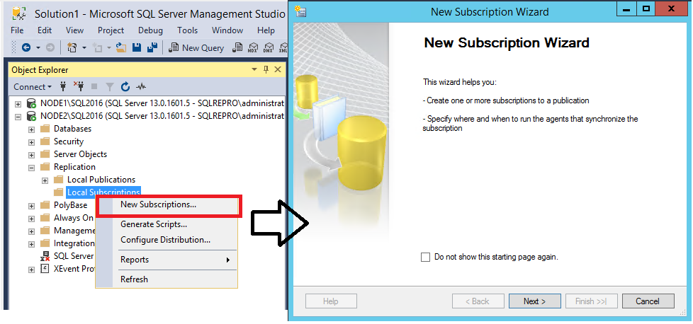
  
2. On the **Publication** page, select **Find SQL Server Publisher** in the **Publisher** list.  
  
   In the **Connect to Server** dialog box, enter the name of the publisher instance in the **Server name** box, and select **Connect**. 

   
  
4. Select **AdvWorksSalesOrdersMerge**, and select **Next**.  
  
5. On the **Merge Agent Location** page, select **Run each agent at its Subscriber**, and then select **Next**:  

   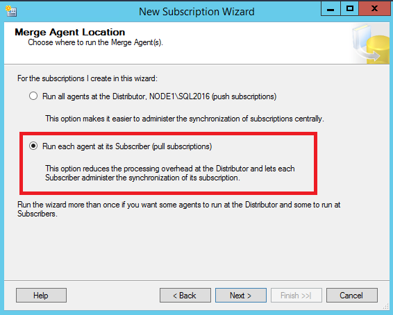
  
6. On the **Subscribers** page, select the instance name of the subscriber server. Under **Subscription Database**, select **New Database** from the list.  
  
   In the **New Database** dialog box, enter **SalesOrdersReplica** in the **Database name** box. Select **OK**, and then select **Next**. 

   
  
8. On the **Merge Agent Security** page, select the ellipsis (**…**) button. Enter <*Subscriber_Machine_Name*>**\repl_merge** in the **Process account** box, and supply the password for this account. Select **OK**, select **Next**, and then select **Next** again.  

   

9. On the **Synchronization Schedule** page, set **Agent Schedule** to **Run on demand only**. Select **Next**.  

   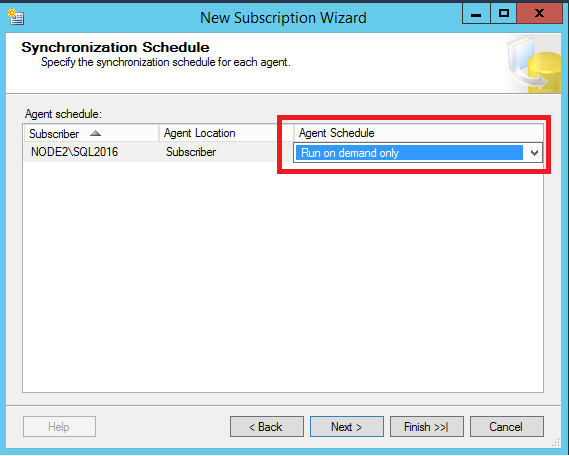
  
9. On the **Initialize Subscriptions** page, select **At first synchronization** from the **Initialize When** list. Select **Next** to proceed to the **Subscription Type** page, and select the appropriate subscription type. This tutorial uses **Client**. After you select the subscription type, select **Next** again. 

   

10. On the **HOST_NAME Values** page, enter a value of **adventure-works\pamela0** in the **HOST_NAME Value** box. Then select **Finish**.  

    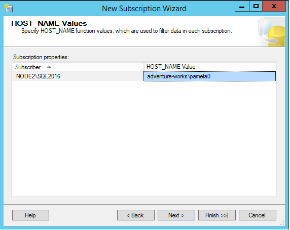
  
11. Select **Finish** again. After the subscription is created, select **Close**.  

### Set server permissions at the subscriber  
  
1. Connect to the subscriber in [!INCLUDE[ssManStudioFull](../../includes/ssmanstudiofull-md.md)]. Expand **Security**, right-click **Logins**, and then select **New Login**.  
  
   On the **General** page, select **Search** and then enter <*Subscriber_ Machine_Name*>**\repl_merge** in the **Enter the Object Name** box. Select **Check Names**, and then select **OK**. 
    
   
  
1. On the **User Mapping** page, select the **SalesOrdersReplica** database and select the **db_owner** role. On the **Securables** page, grant the **Explicit** permission to **Alter Trace**. Select **OK**.

   
  
### Create the filtered data snapshot for the subscription  
  
1. Connect to the publisher in [!INCLUDE[ssManStudioFull](../../includes/ssmanstudiofull-md.md)], expand the server node, and then expand the **Replication** folder.  
  
2. In the **Local Publications** folder, right-click the **AdvWorksSalesOrdersMerge** publication, and then select **Properties**.  
   
   a. Select the **Data Partitions** page, and select **Add**.   
   b. In the **Add Data Partition** dialog box, enter **adventure-works\pamela0** in the **HOST_NAME Value** box, and then select **OK**.  
   c. Select the newly added partition, select **Generate the selected snapshots now**, and then select **OK**. 

   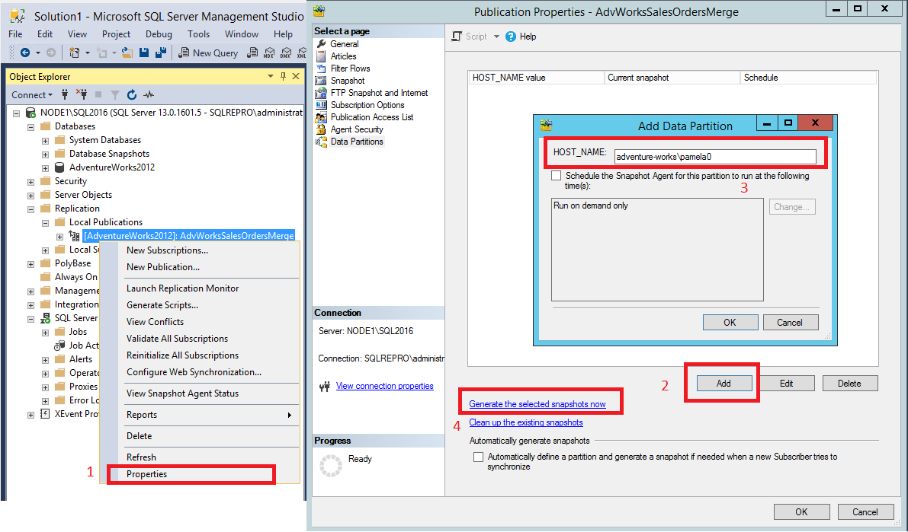
  
  
For more information, see:  
- [Subscribe to publications](../../relational-databases/replication/subscribe-to-publications.md)  
- [Create a pull subscription](../../relational-databases/replication/create-a-pull-subscription.md)  
- [Snapshots for merge publications with parameterized filters](../../relational-databases/replication/create-a-snapshot-for-a-merge-publication-with-parameterized-filters.md)  

## Synchronize the subscription to the merge publication

In this section, you start the Merge Agent to initialize the subscription by using [!INCLUDE[ssManStudioFull](../../includes/ssmanstudiofull-md.md)]. You also use this procedure to synchronize with the publisher.   
  
### Start synchronization and initialize the subscription  
  
1. Connect to the subscriber in [!INCLUDE[ssManStudioFull](../../includes/ssmanstudiofull-md.md)].  
2. Make sure that the SQL Server Agent is running. If it's not, right-click the SQL Server Agent in Object Explorer and select **Start**. If this step fails to start your agent, you'll need to do so manually by using SQL Server Configuration Manager. 
  
2. Expand the **Replication** node. In the **Local Subscriptions** folder, right-click the subscription in the **SalesOrdersReplica** database, and then select **View Synchronization Status**.  
  
   Select **Start** to initialize the subscription. 

   
    
  
  
## Next steps  
You have successfully configured both your publisher and your subscriber for your merge replication. You can also:

1. Insert, update, or delete data in the **SalesOrderHeader** or **SalesOrderDetail** table at the publisher or subscriber.
2. Repeat this procedure when network connectivity is available to synchronize data between the publisher and the subscriber.
3. Query the **SalesOrderHeader** or **SalesOrderDetail** table at the other server to view the replicated changes.  
  
For more information, see:   
- [Initialize a subscription with a snapshot](../../relational-databases/replication/initialize-a-subscription-with-a-snapshot.md)  
- [Synchronize data](../../relational-databases/replication/synchronize-data.md)  
- [Synchronize a pull subscription](../../relational-databases/replication/synchronize-a-pull-subscription.md)  
  
  
  
